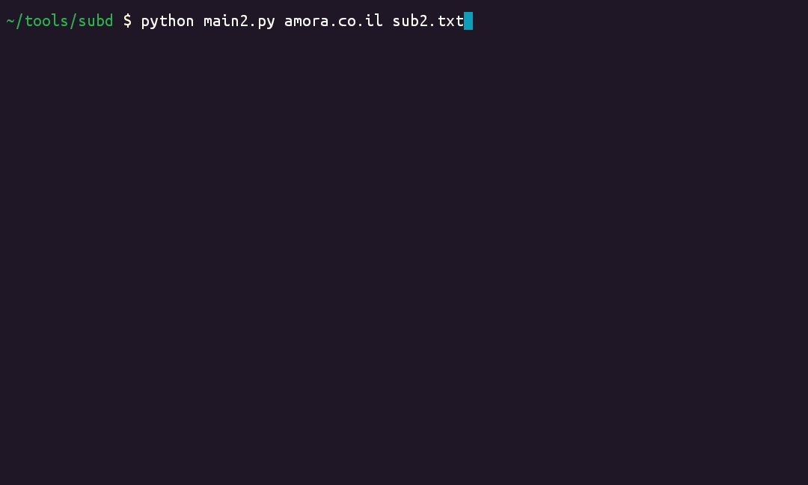
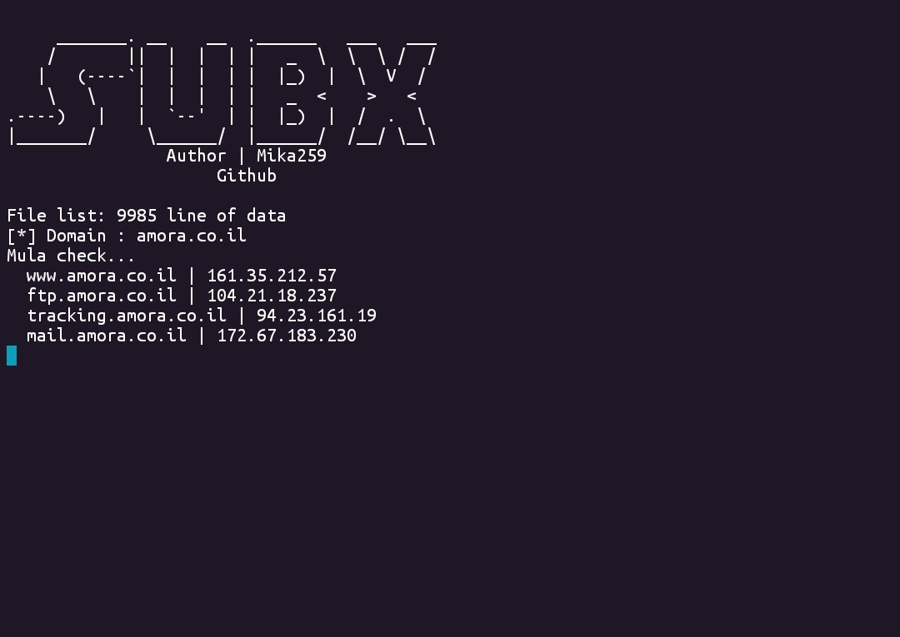

# subx
Subdomain finder python tool

# Screenshot




- sub2.txt [wordlist]
- main2.py [tool]

```bash
python main2.py example.com worlist.txt
```

# Usage
```txt
usage: main2.py [-h] domain wordlist

Tool Subdomain Finder

positional arguments:
  domain      Nama domain untuk dicari (contoh: example.com)
  wordlist    Fail wordlist untuk subdomain (contoh: subdomains.txt)

options:
  -h, --help  show this help message and exit
```
